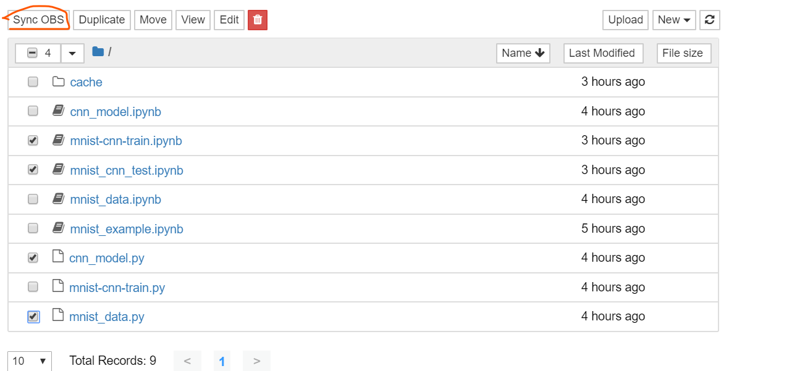

# 内容三：改进的mnist手写数字识别

author:周洪弘

time: 20191208

## 改进的主要技术点：

- 使用三层的卷积神经网络
- 将原图片进行旋转，随机像素偏移等操作实现数据增广，数据量变为5倍
- 权重矩阵的**Xavier**初始化与偏置的0值初始化
- 做Batch normalization
- 加入dropout机制
- 使用指数衰减的学习率

## 参考

### 原项目地址

 https://github.com/hwalsuklee/tensorflow-mnist-cnn 

在这个项目的基础上做了modelarts的适应性以及版本方面的一些更改。已在modelarts的notebook上调通。

### modelarts上的教程

1. moxing文件操作：  https://github.com/huaweicloud/ModelArts-Lab/blob/master/docs/moxing_api_doc/MoXing_API_File.md 
2. modelarts图片识别项目:  https://github.com/huaweicloud/ModelArts-Lab/tree/master/notebook/DL_image_recognition 
3. 内容二手写数字识别：  https://github.com/huaweicloud/ModelArts-Lab/tree/master/official_examples/Using_TensorFlow_to_Create_a_MNIST_Dataset_Recognition_Application/codes 

## 使用方式

### 准备

将该项目文件上传到桶，使用modelarts->开发环境->notebook打开项目。我的设定是使用一张p100，环境是tensorflow1.8。将如下几个项目打勾，然后点击Sync OBS，使其可以互相调用.

### 训练

训练前务必将data_url改为自己的，即s3://开头的地址。

然后点开mnist-cnn-train.ipynb运行所有cell

一点解释：由于桶中数据和notebook工作目录是单独的，为了加快读取速率，先将桶中数据集读取到工作路径，然后训练，训练生成的模型会保存到本地（工作路径），所以训练完成后我还写了代码将生成的模型传到桶中。

### 测试

运行mnist_cnn_test.ipynb.

## 剩余工作

1. 我是在modelarts开发环境下写的程序,需要部署，实现内容2那样的在线预测的效果。部署需要的模型训练代码已经将其传到桶中。
2. （可选）进一步改进网络，如增加层数或者使用流行的resnet，vgg等网络
3.  撰写实验报告。

有问题大家一起交流。

